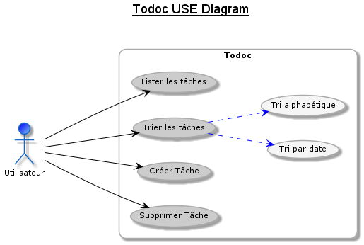
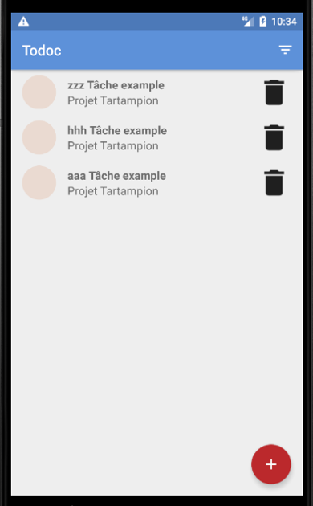
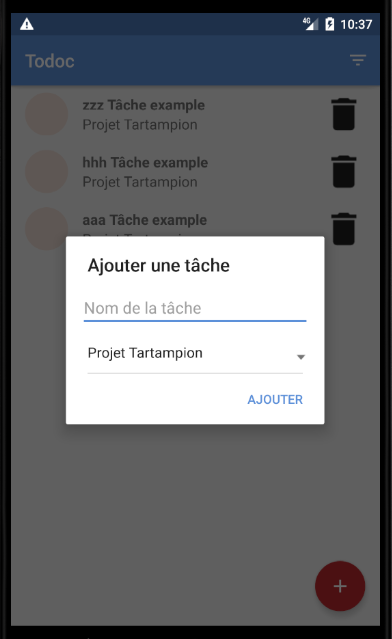
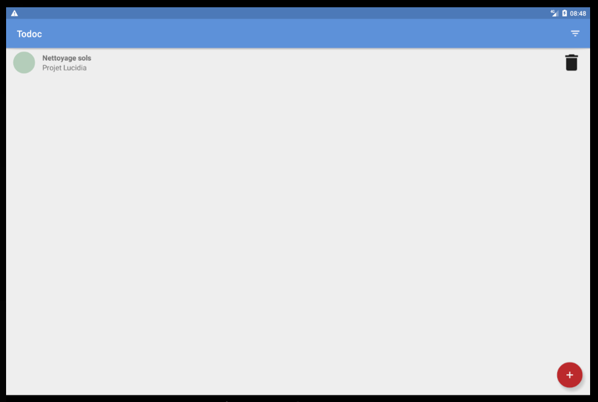
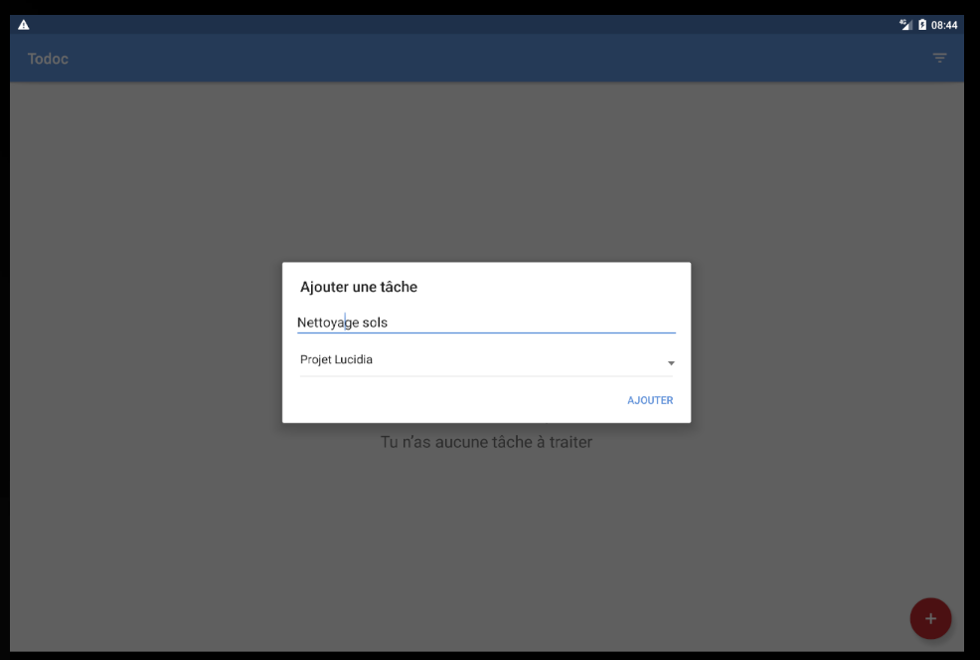

#  Todoc

### Présentation :
Ce dépôt contient l'application Todoc (5ème projet du parcours Développeur Android Junior d'OpenClassrooms).   
L'application est une gestion de Tâches qui est à la base développée sans la persistance des données.
* Les principales fonctionnalités sont :
 - Affichage de la liste des tâches avec :  
    - Cercle couleur lié au projet.
    - Libellé de la tâche.
    - Nom du projet.
 - Suppression d'une tâche.
 - Création d'une d'une tâche.
 - Tri par date ou alphabétique des tâches.

### Les travaux à réaliser :  
* Implémentation d'une base données SQLite : assurer la persistance des données.
* Réalisation d'un diagramme relationnel.
* Réalisation d'un diagramme de classe :
  - Mettre en avant les différentes classes utilisées et leur relations entre elles.
* Réalisation d'un diagramme d'utilisation :   
  - Visualiser le comportement fonctionnel de l'application.
* Code de l'application obfusqué en version "release", afin de protéger encore plus le code source du projet.
* Déploiement de l'application sur le Play Store en mode "bêta", avec creation d'une version "release" et "signée", en générant l'APK correspondant.
* Mise à jour des tests, afin d'intégrer SQLite à l'application.

### Quelques précisions :
* Utilisation de Plantuml pour les diagrammes d'utilisation et classes.
  - L'avantage premier est son intégration dans Android Studio
  - Il est possible de personnaliser l'apparence couleur et disposition en creusant un peu. :wink:

  

* Les objectifs d'acquisitions de comptétences de ce projet sont :
  - L'architecture MVVM.
  - Etablir des diagrammes de classes, relationnels, utilisation.
  - Protection du code en procédant à son obfuscation.
  - Générer une version en format APK signée et déploiement sur le PlayStore.

* Gestion de l'aspect responsive sur différents périphériques ou orientations.

 ------ 

 

 
